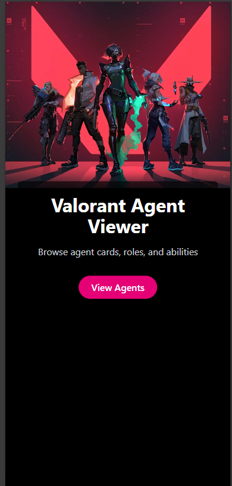
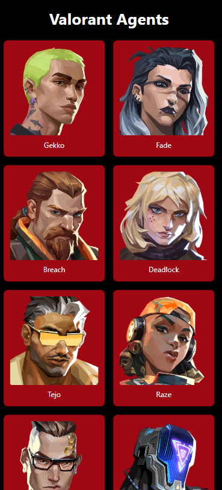
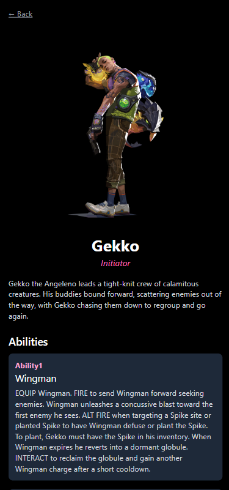
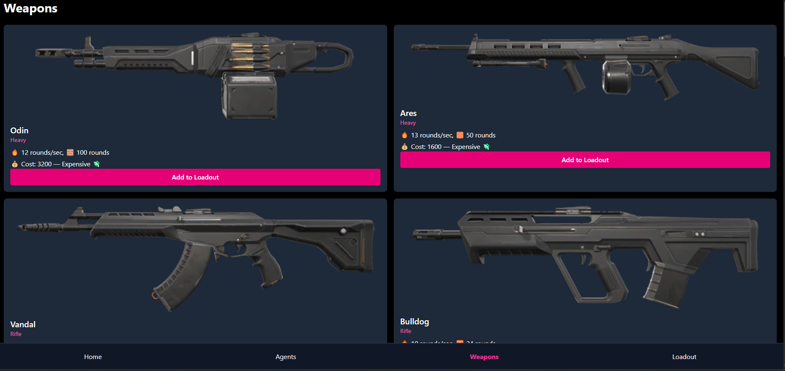
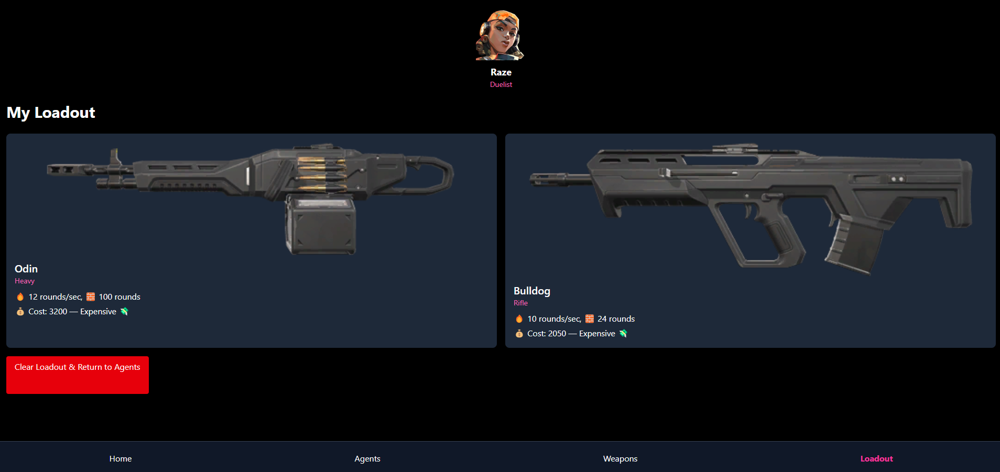
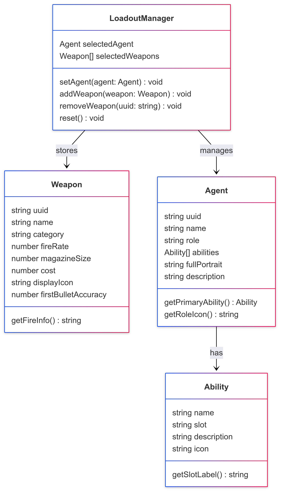

# Valorant Agent Viewer

A mobile-responsive web app that displays Valorant agents, their roles, and abilities using the official [Valorant API](https://dash.valorant-api.com/).

## 🔍 Features

- 🎯 Browse all playable Valorant agents
- 📖 View detailed roles and abilities per agent
- 🛡 Select a main agent
- 🔫 Choose 2 weapons and view your custom loadout
- 🧹 Clear loadout and restart flow
- 📱 Fully mobile-responsive layout
- ⚡ Built with Vite + React + Tailwind CSS

## 🔗 Valorant API Endpoints Used

- **All Agents**: `https://valorant-api.com/v1/agents?isPlayableCharacter=true`
- **Agent by UUID**: `https://valorant-api.com/v1/agents/{uuid}`
- **All Weapons**: `https://valorant-api.com/v1/weapons`

## 🛠 Tech Stack

- **Frontend**: React, Vite, TypeScript, Tailwind CSS
- **Routing**: React Router
- **State/Storage**: LocalStorage + custom LoadoutManager
- **API**: [Valorant API](https://valorant-api.com/)
- **Deployment**: Netlify

## 🚀 Live Demo

👉 [View on Netlify](https://valproject.netlify.app/)  


## 📸 Screenshots

| Landing Page | Agent List | Agent Detail | Weapons | Loadout |
|--------------|------------|---------------|---------|---------|
|  |  |  |  |  |


## 🧩 Getting Started (Local Setup)

```bash
# Clone the repo
git clone https://github.com/bgnoon/valorant-agents.git
cd valorant-agents

# Install dependencies
npm install

# Start dev server
npm run dev
```

## 🧩 Component Hierarchy Diagram

This diagram shows how the components in the app are structured, including pages, reusable components, and navigation flow.


## 🗃️ Entity-Relationship Diagram (ERD)

This diagram outlines the data relationships between agents, weapons, abilities, and loadouts.

